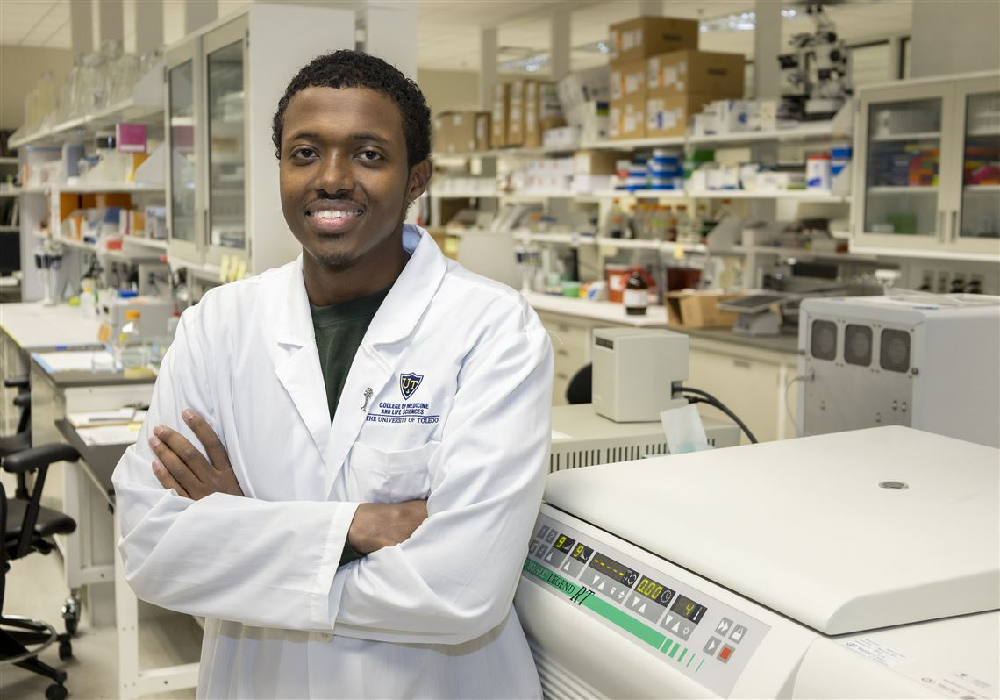

[Abdul-Rizaq Ali Hamoud](/authors/abdul), a Ph.D. student in the Neurosciences and Neurological Disorders track from the Cognitive Disorders Research Laboratory (CDRL) had his research story "UT researchers investigate unusual cancer rates in schizophrenia patients” published in The Blade this week.

[Read Article](https://www.toledoblade.com/a-e/living/2022/05/02/university-of-toledo-medical-column-may-2-abdul-rizaq-hamoud-cancer-in-schizophrenic-patients/stories/20220502001)

