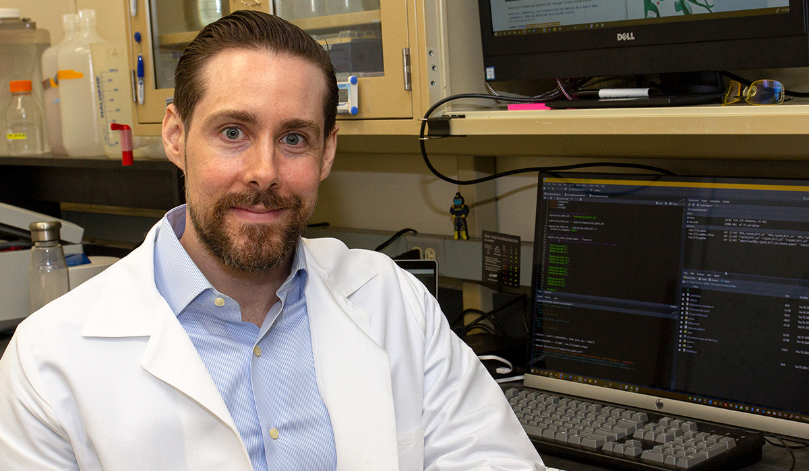

Drs. Justin Creeden, Khaled Alganem, Ali Imami, and Robert Smith recently published an article in Hepatology (Impact Factor 17.4) with Dr. Terry Hinds and collaborators at the University of Kentucky.

This paper combines bioinformatic studies with basic science laboratory validation studies to generate the first kinome atlas for hepatic fibrosis. In this piece, we utilize human cirrhosis samples and three murine models of fibrosis to measure concordance between human and rodent hepatic kinome signaling. We also identify protein tyrosine kinases or serine/threonine kinases with altered levels of kinase activity in the fibrotic pathways of both species.

[Read Article](https://pubmed.ncbi.nlm.nih.gov/35313030/)

