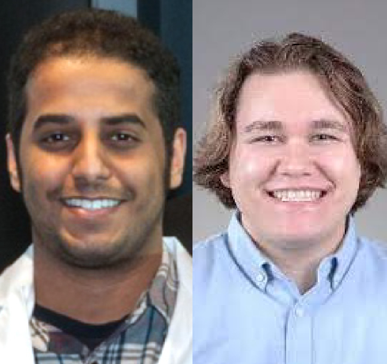

[Khaled Alganem](/authors/khaled), a Ph.D. student in the Cognitive Disorders Research Laboratory (CDRL), was awarded the "***Doctor of Philosophy in Biomedical Sciences Outstanding Student***" award of this year's College of Medicine and Life Sciences (COMLS) Graduation Awards. [William (Billy) Ryan](/authors/billy), a Master's student in the Cognitive Disorders Research Laboratory (CDRL), also received the "***Master of Science in Biomedical Sciences Basic Science Research Outstanding Student***" award.

[Dr. Kandace Williams](https://www.utoledo.edu/med/depts/cancer-biology/faculty/williams.html), the Senior Associate Dean for College of Medicine & Life Sciences Graduate, congratulated all the awardees: "*You all have worked long and hard for these highest Awards of the College of Medicine and Life Sciences and you well deserve them! I am very proud of you all and very excited to let you know that you are the top graduate student winners in your respective programs of 2022!*"

The Class of 2022 Graduation Awards Ceremony will be “live” Thursday May 19 from 3 – 5 PM in the Collier Building, Rm 1000A/B to honor the awards recipients.

Congratulations to [Khaled](/authors/khaled) and [Billy](/authors/billy) for these outstanding achievements!

