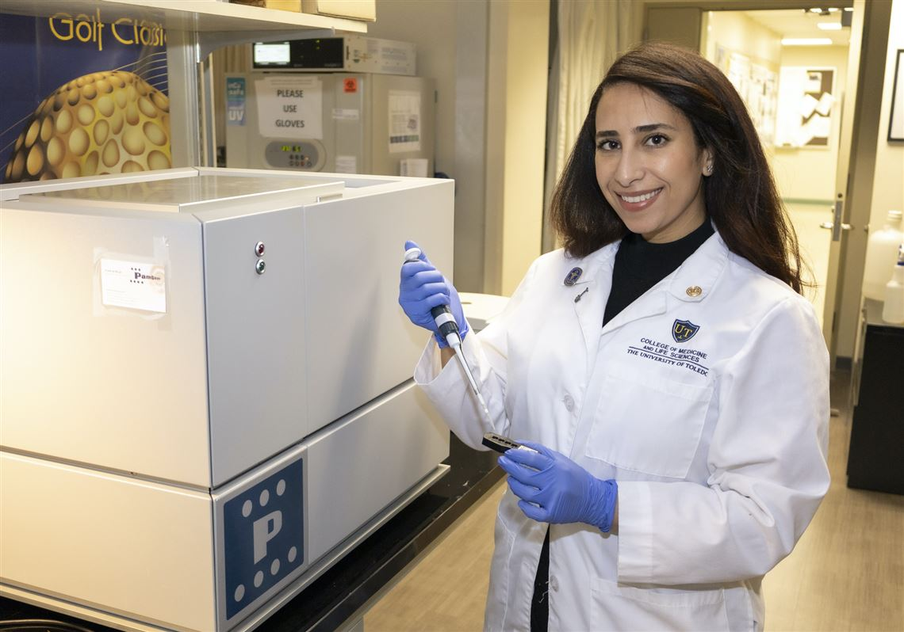

[Rawan Alnafisah](/authors/rawan), a Ph.D. student in the Molecular Medicine track from the Cognitive Disorders Research Laboratory (CDRL) had her research story "UT researchers look for answers to depression on a molecular level” published in the Blade this week.

[Read Article](https://www.toledoblade.com/a-e/culture/2022/02/07/university-of-toledo-medical-research-on-depression/stories/20220207001)

